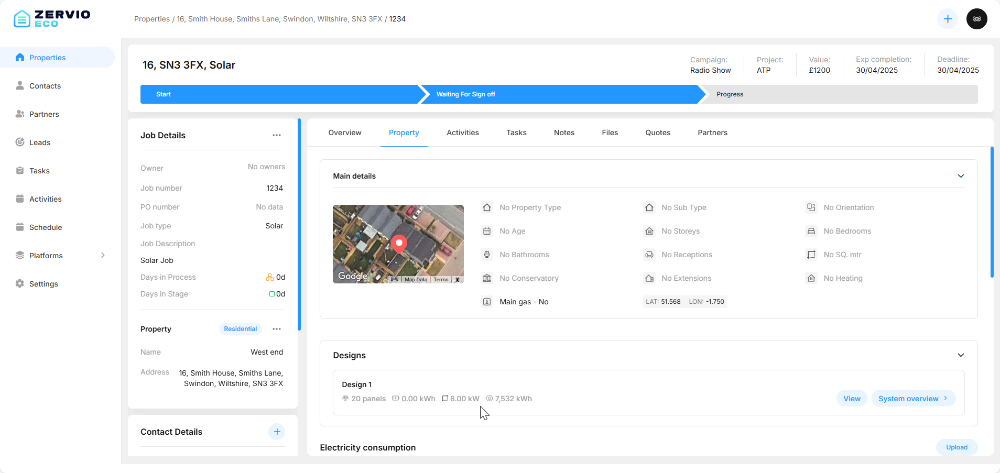
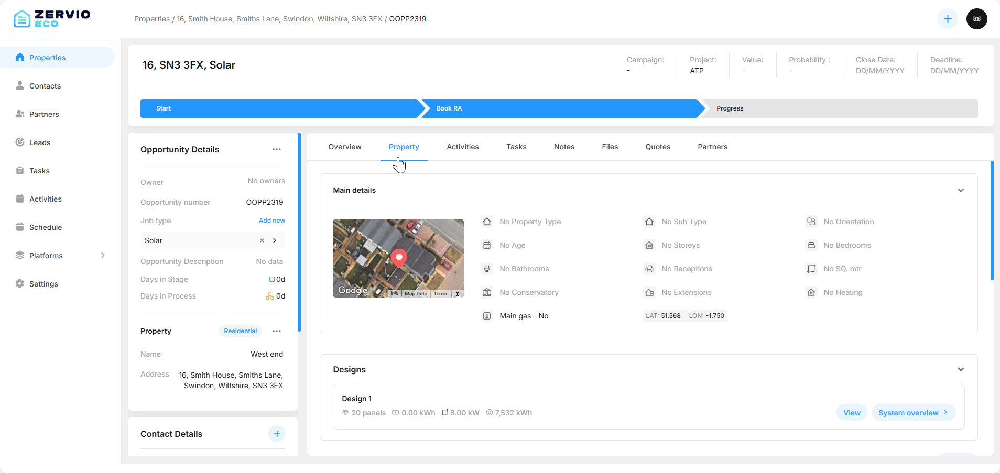
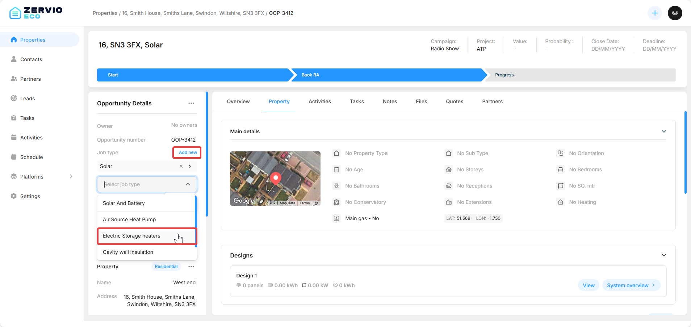
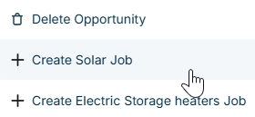
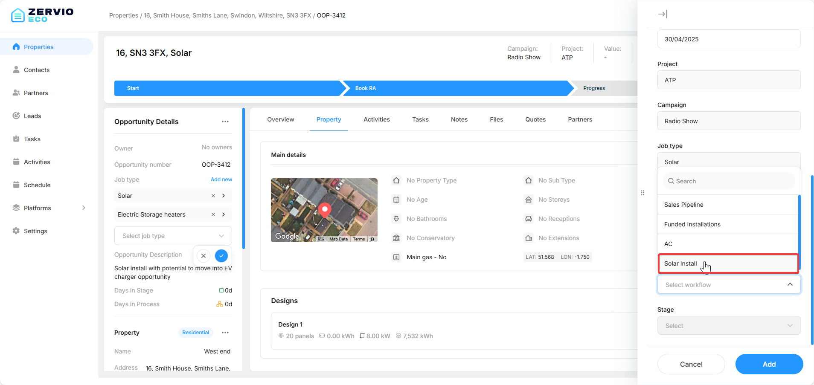
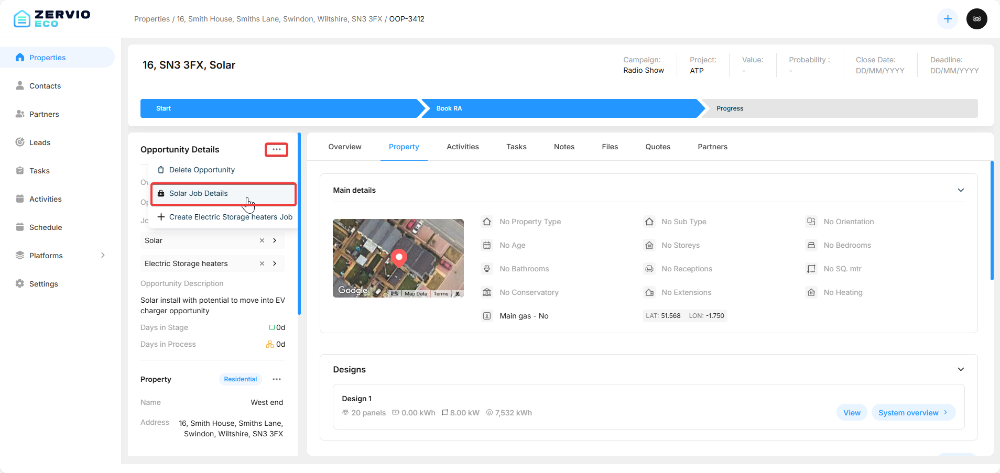

# How to Schedule a Job

When a job is created, you will need to add activities to the job in order for it to be completed. In this guide, you'll learn how to add an activity to a job and assign crew members to the job.

At the end of this guide, you'll have access to this job page for your property.

## Prerequisites

- A Property
- An Opportunity
- A Workflow for the specific job

If you do not have these configured or created yet, see the guides on [how to add a property](/Guides/adding-a-property.md), [how to add an opportunity](/Guides/adding-an-opportunity.md), and [how to configure a workflow](/Guides/creating-a-workflow.md).

Here's a gif of the entire process

## Creating a Job

First, search for the property you'd like to add a job to and click on the opportunity you have added.

On the opportunity page, click the three dots `...` on the top right of the **Opportunity Details** widget. If you added a job type when initially creating the opportunity, you should already see an option to add a job.

If not, click the `add new` button under **Job Type** and select a job type.

Now click the three dots `...` again and select the `Create (your-job-type) Job` option.

In the side menu, enter the details for the job. Under **Workflow**, select the workflow for the job. If you do not have any workflows set up, see the guide on [how to configure a workflow](/Guides/creating-a-workflow.md). We clicked "Solar Job," so we'll select a solar install workflow and choose the appropriate stage to start the job.

After filling in the job details, click the `Add` button, and your job will be created.
To verify it has been created, click the three dots `...` on the top right of the **Opportunity Details** widget. In the menu, you should see a `Job Details` icon for the job you added.

When clicked, you should see a page like this, and you have successfully created a job for your property.

# Conclusion

Now that you've created the job, you'll need to add activities to it. See the guide on [how to add an activity to a job](/Guides/adding-an-activity-to-a-job.md).
